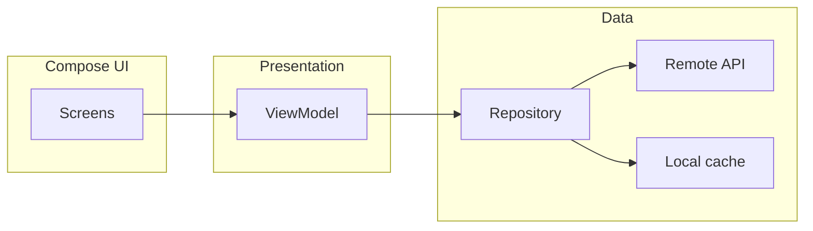

<!-- PRESERVATION RULE: Never delete or replace content. Append or annotate only. -->

# Architecture — Word of the Day (Android)

## Overview

Planned **single-activity** Android app using **Jetpack Compose** for UI and **Kotlin** throughout. Business rules and async work sit outside composables; UI observes immutable **UI state**.

## Layers (target)

1. **UI (Compose)**  
   Screens, theme, strings, navigation. Calls ViewModel intents / events only.

2. **Presentation (ViewModel)**  
   Exposes `UiState` and handles user actions; uses coroutines (`viewModelScope`).

3. **Domain (optional thin use cases)**  
   If logic grows, isolate “what is today’s word?” policy here.

4. **Data**  
   - **Repository** merges remote + local sources.  
   - **Remote**: API client (e.g. Retrofit/Ktor) when not bundled-only.  
   - **Local**: DataStore / Room for preferences or cache (when added).

## Module layout (suggested)

- `:app` — application module, navigation, DI entry (if used).  
- Future `:core:model`, `:core:data` if the app outgrows a single module.

## Form factors

- **Adaptive UI** driven by window size / width breakpoints (Material 3 adaptive patterns).  
- Shared ViewModel for a screen where possible; avoid duplicating “today” logic per device class.

## Diagram (conceptual)

`[2026-03-29]` Initial architecture notes.

`[2026-06-17]` **Data (shipped):** Bundled JSON only — no remote API. **`JsonWordDataSource`** loads **`assets/words/<grade>.json`** (curated corpus) and optionally merges **`assets/lexicon/`** when **`LexiconPreferences`** opt-in flags are set (WordNet per-grade files + myth/sacred/literary packs). **`WordRepository`** applies grade/category filters and adjacent-grade fallback. **`UserPreferencesRepository`** (DataStore) persists grade, categories, and lexicon toggles. See [CONTENT_SOURCES.md](./CONTENT_SOURCES.md).
