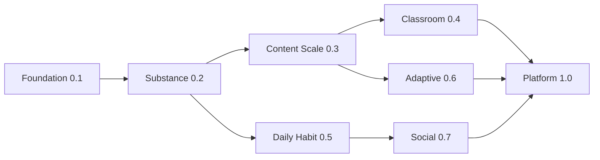

<!-- PRESERVATION RULE: Never delete or replace content. Append or annotate only. -->

# Editions roadmap — Word of the Day (Android)

Multi-edition master plan for **huge update waves**. This doc complements [ROADMAP.md](./ROADMAP.md) (engineering checklist) with **product editions**, release themes, success metrics, and dependency ordering.

**Current app version:** `0.2.1` (versionCode **3**) — **Edition 2–3 bridge**: Substance shipped; **§8d MVP corpus complete** (2,218 rows).

**Related:** [CHANGELOG.md](./CHANGELOG.md) · [AppReleaseCatalog.kt](../app/src/main/java/com/example/wordofday/data/release/AppReleaseCatalog.kt) (in-app What's New) · [AGENTS.md](../AGENTS.md) (release sync rules).

---

## Edition overview

| Edition | Codename | Target version | Theme | Status |
| --- | --- | --- | --- | --- |
| **E1** | Foundation | `0.1.x` | Bootable WOTD, grades, categories, nav shell | **Shipped** |
| **E2** | Substance & Discovery | `0.2.x` | Quiz, library, rich words, engagement, What's New | **In progress** (core shipped `0.2.0`) |
| **E3** | Content Scale | `0.3.x` | ~2,700 MVP words, 8 more categories, QA pipeline | **MVP matrix shipped** `[2026-06-17]` — remainder: 8 categories, §8e audit |
| **E4** | Classroom & Family | `0.4.x` | Profiles, assignments, parent dashboard | Planned |
| **E5** | Daily Habit | `0.5.x` | Widget, notifications, Wear, streak economy | Planned |
| **E6** | Adaptive Learning | `0.6.x` | Spaced repetition, weak-word drill, Room history | Planned |
| **E7** | Social & Share | `0.7.x` | Leaderboards, friend streaks, export decks | Planned |
| **E8** | Platform & Polish | `1.0.x` | Play release, i18n, accessibility certification | Planned |

---

## Edition 2 — Substance & Discovery (`0.2.x`)

**Goal:** Turn a daily word viewer into a **learning loop** (read → save → review → quiz).

### Shipped in `0.2.0`

- [x] Quiz mode (5 MC questions, lifetime stats)
- [x] Library: history list, favorites, word detail
- [x] History **calendar** month view
- [x] Rich `WordEntry`: synonyms, usageNote
- [x] Home engagement: quick-switch, easier/harder, category swipe, streak UI
- [x] **Update modal** + Settings → **What's new**
- [x] Streak milestone messages (7 / 30 / 100 days)
- [x] Expanded grade 5–6 corpus (15 words each, full metadata)

### E2 remainder (`0.2.1` – `0.2.9`)

- [ ] Quiz modes: reverse (definition → word), timed blitz, grade-only pool picker
- [ ] Library: sort favorites (A–Z, date, grade); search/filter
- [ ] History: export month as shareable text / PDF
- [ ] Word cards: antonyms, word family, "use in a sentence" user note (local)
- [ ] Onboarding: preview quiz + library in tour
- [ ] Instrumentation: Compose smoke test for home → quiz → library
- [ ] Expand grade 7–12 + adult to ≥15 words/file with synonyms/usage

**E2 exit criteria:** D7 retention measurable; quiz completion rate >40%; library opens >15% of DAU.

---

## Edition 3 — Content Scale (`0.3.x`)

**Goal:** Fill the **§8d MVP matrix** and unlock all **14 categories** in UI.

### Scope

- [ ] **~2,700 words** (30 × 15 grades × 6 MVP categories) — track [CONTENT_8D_PROGRESS.md](./CONTENT_8D_PROGRESS.md)
- [ ] Enable remaining 8 categories in onboarding/settings (CARS, SPACE, MUSIC, HISTORY, MATH, HEALTH, WEATHER, EMOTIONS)
- [ ] Content QA pipeline: reading-level lint script + spot-check checklist (§8e)
- [ ] Optional CDN/asset-pack delivery for large corpus (Play Asset Delivery)
- [ ] Duplicate-lemma CI gate on every PR touching `assets/words/`
- [ ] Category icons + accent colors for all 14

### Milestones

| Milestone | Words (est.) | Categories | Notes |
| --- | --- | --- | --- |
| E3.0 | 500 | 6 | Middle/high school priority |
| E3.5 | 1,500 | 6 | All grades ≥20/cell average |
| E3.9 | 2,700 | 6 | MVP matrix complete |
| E3.10 | +1,800 | 10 | v1.1 category expansion |

**E3 exit criteria:** No empty quiz pools for any grade×MVP category; inventory gap sum **0**.

---

## Edition 4 — Classroom & Family (`0.4.x`)

**Goal:** Multi-learner households and light classroom use without accounts server.

### Scope

- [ ] **Local profiles** (up to 6): name, grade, categories, separate streak/quiz stats
- [ ] Profile switcher on home; per-profile history/favorites
- [ ] **Parent PIN** gate for settings / profile management
- [ ] **Word list assignments**: "Study these 10 words this week" from favorites or category
- [ ] Printable / shareable weekly word sheet (teacher handout format)
- [ ] Optional **teacher pack** JSON import (custom word lists)
- [ ] DataStore → Room migration for profiles + history at scale

**E4 exit criteria:** Two profiles on one device with independent streaks; assignment completion tracked locally.

---

## Edition 5 — Daily Habit (`0.5.x`)

**Goal:** Meet users **outside the app** every morning.

### Scope

- [ ] **Home screen widget** — today's word + tap to open app
- [ ] **Daily notification** (WorkManager, opt-in time picker)
- [ ] Notification actions: Share, Open quiz, Mark read
- [ ] **Wear OS** tile / complication (word + streak)
- [ ] Streak **freeze** (1/month) and recovery nudge after miss
- [ ] Milestone badges collection screen
- [ ] Deep links: `wordofday://word/today`, `wordofday://quiz`

**E5 exit criteria:** Widget install rate tracked; notification opt-in >25% of MAU; cold start from widget <1.5s.

---

## Edition 6 — Adaptive Learning (`0.6.x`)

**Goal:** Personalized review based on what users miss.

### Scope

- [ ] **Room** database: word views, quiz attempts, SM-2 spaced repetition schedules
- [ ] "Review due" queue on home (words missed in quiz or marked hard)
- [ ] Leitner-style decks from favorites + history
- [ ] Difficulty signal: easier/harder taps feed adaptive grade suggestion
- [ ] Weekly progress report (words learned, quiz accuracy trend)
- [ ] Offline-first sync-ready schema (future backend optional)

**E6 exit criteria:** Review queue non-empty for returning users; measurable quiz accuracy improvement over 14 days.

---

## Edition 7 — Social & Share (`0.7.x`)

**Goal:** Motivation through **light social** (privacy-first, optional).

### Scope

- [ ] Anonymous **weekly leaderboard** (opt-in, quiz score / streak)
- [ ] Share streak card as image (Instagram story size)
- [ ] **Family link**: compare streaks on shared household code (no PII)
- [ ] Export / import favorite deck (JSON share intent)
- [ ] Classroom code: teacher shares week's word pack hash

**E7 exit criteria:** Share intent used >5% WAU; zero collection of child PII without parent gate.

---

## Edition 8 — Platform & Polish (`1.0.x`)

**Goal:** **Play Store production** release.

### Scope

- [ ] Release signing + Play App Signing documented
- [ ] Play **Data safety** form aligned with DataStore-only collection
- [ ] Full **TalkBack** + large-font audit
- [ ] **Localization**: UI strings (es, fr, de minimum); content stays EN until E8+
- [ ] Tablet/foldable marketing screenshots + dedicated QA matrix
- [ ] In-app **feedback** + crash reporting (Firebase Crashlytics or equivalent)
- [ ] Semantic versioning policy in CHANGELOG; automated release notes from AppReleaseCatalog

**E8 exit criteria:** Play internal testing track; crash-free sessions >99.5%; store listing live.

---

## Post-1.0 horizon (E9+)

| Idea | Edition sketch |
| --- | --- |
| AI example sentences (on-device or API, age-gated) | E9 |
| OCR "word of the day" from books | E9 |
| Cross-platform (Compose Multiplatform / iOS) | E10 |
| District SSO + rostered classroom | E11 |
| User-generated word lists (moderated) | E11 |
| Subscription tier: premium categories + unlimited profiles | E12 |

---

## Release discipline (mandatory)

Every user-facing release **must** update together (see [AGENTS.md](../AGENTS.md)):

1. `app/build.gradle.kts` — `versionCode` + `versionName`
2. `DOCS/CHANGELOG.md` — Keep a Changelog section
3. `AppReleaseCatalog.kt` — modal bullets (newest first)
4. `DOCS/EDITIONS_ROADMAP.md` — edition status table + checkboxes
5. `DOCS/SCRATCHPAD.md` — last actions

`versionCode` must monotonically increase. `AppReleaseCatalog` row must exist for every shipped `versionCode`.

---

## Dependency graph (editions)

---

`[2026-06-17]` Initial editions roadmap — E1–E8 + post-1.0 sketch; E2 partial ship at `0.2.0`.
